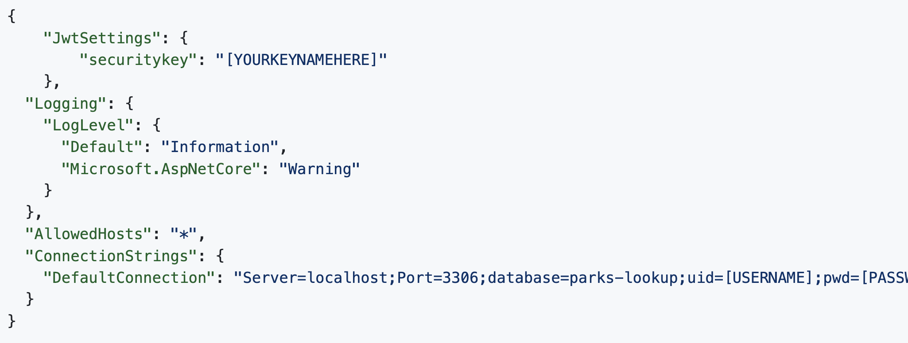
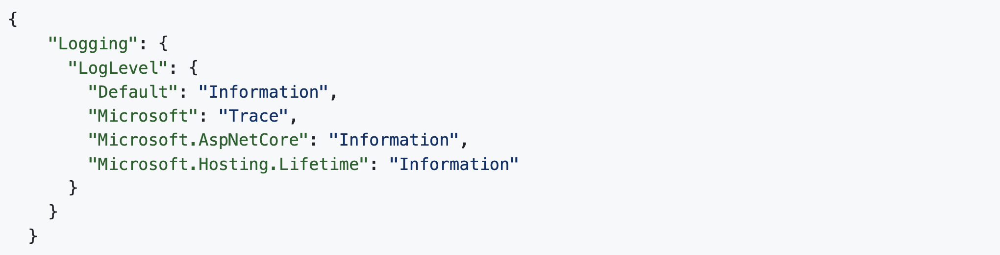

# Local Business API
Names of contributors: By Viradeth Xay-ananh.  
ASP.NET Core Web API for local business and shops.

# Description 
A ASP.NET Core Web API that gets list of restaurant and shops.  User can update,edit and delete from both Restaurants and Shops databases.  User can generate access token for already created user in the db.  Performing a POST call in either swagger or POSTMAN.

## Technologies Used
* C#
* Dot Net 6.0
* Markup
* Git
* ASP.NET MVC
* CSS
* HTML5
* Microsoft EntityFramework Core
* Swagger
* JWT

# Complete setup/Installation instructions:
* Clone repository to your desktop 
* CD to the Directory: LocalBusinessApi
* While in the current directory [Factory]  
* Create appsettings.json file 
* Replace the following values shown in image with: 
* [securitykey]: your security key
* [YOUR-DB-NAME]: database included in project
* [YOUR-USER-HERE]: with your username
* [YOUR-PASSWORD-HERE]: with your password
* Create anohter file called: appsettings.Development.json  
* Enter in command: 'dotnet ef database update'
* Add the appsettings.json and appsettings.Development.json file to .gitignore.
* To view web application. Run commands: dotnet watch run 
* Open the browser, go to https://localhost:5001

# Known bugs: 
No bugs 

## License

[MIT](https://opensource.org/licenses/MIT)  
Copyright (c) _03/31/2023_ _viradeth xay-ananh_